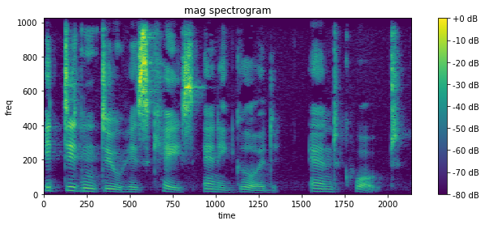

# Speech-Processing

The signal processing is difficult for non-domain experts.

This code is about simple signal processing for speech synthesis.

I use 1 audio sample from LJSpeech.

## Waveform

## Magnitude spectrogram

## Mel spectrogram

